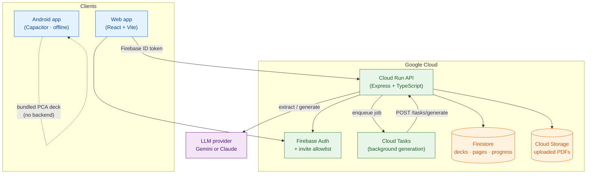
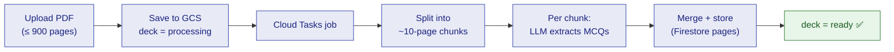
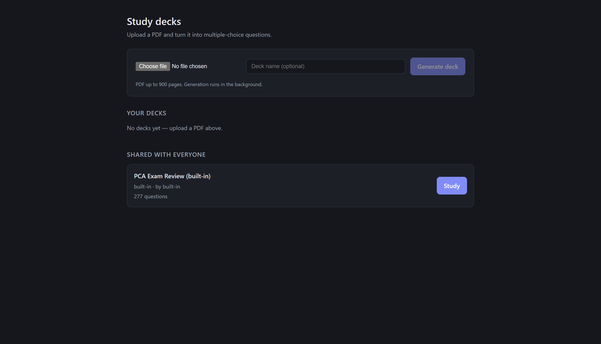
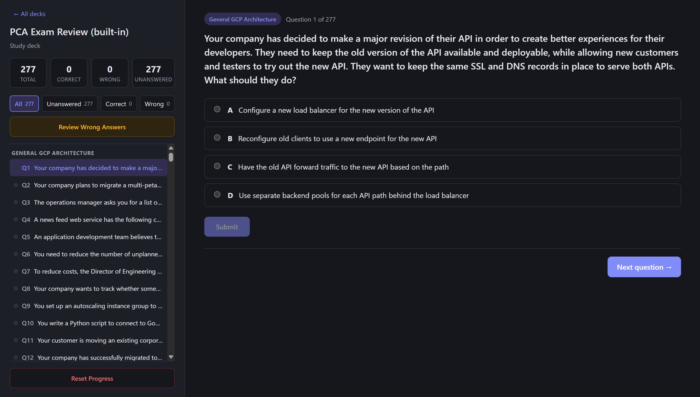

# QuizForge

Turn any PDF into a multiple‑choice study deck. Upload exam notes or a question
bank and QuizForge uses an LLM (Google Gemini or Anthropic Claude) to extract or
generate questions, then lets you study them with per‑question grading,
explanations, filters, and synced progress.

It ships in three forms from one codebase:

- a **web app** (deck library + PDF upload + study) backed by a Cloud Run API,
- a backend that does the **PDF → questions** generation, and
- an **offline Android app** that bundles a ready‑made 277‑question Google Cloud
  Professional Cloud Architect deck (no backend needed).

> 📱 Android APK: see the [Releases](../../releases) page — each build is published
> as `QuizForge-<date>.apk`.

## Architecture



### How generation works

A large PDF (up to 900 pages) can't go to the model in one request, so the
backend chunks it, generates per chunk in parallel off the request path, and
merges the result.



## Screenshots

<table>
  <tr>
    <td></td>
    <td></td>
  </tr>
  <tr>
    <td align="center"><b>Deck library</b> — your decks + shared, upload a PDF</td>
    <td align="center"><b>Study view</b> — grade, explanations, Next →</td>
  </tr>
</table>

## Features

- **Decks from PDFs** — upload a PDF; the backend extracts existing questions
  (e.g. an exam dump) or generates new ones from study material, with a written
  explanation for every option.
- **Study experience** — one question at a time, single/multi‑select, submit to
  grade, a **Next question** button, filters (All / Unanswered / Correct / Wrong),
  and a read‑only **Review Wrong Answers** mode.
- **Private + shared decks** — your uploads are private; mark one shared to make
  it available to everyone.
- **Synced progress** — study progress is per‑user in Firestore, so it follows
  you across devices (the offline Android app uses on‑device storage).
- **Built‑in PCA deck** — a corrected 277‑question Google Cloud Professional
  Cloud Architect deck is always available (auto‑seeded), and is what the offline
  Android app bundles.

## Repository layout

| Path | What it is |
|------|------------|
| [`frontend/`](frontend/) | Web app (React + Vite): deck list, PDF upload, study view |
| [`frontend/android/`](frontend/android/) | Capacitor Android project (offline QuizForge build) |
| [`backend/`](backend/) | Backend API (Cloud Run) — **[backend/README.md](backend/README.md)** |
| [`infra/`](infra/) | Terraform for the backend — **[infra/README.md](infra/README.md)** |
| [`.github/workflows/`](.github/workflows/) | CI: Android APK build + release |
| [`frontend/src/data/questions.json`](frontend/src/data/questions.json) | The built‑in PCA question set |
| [`Makefile`](Makefile) | `make dev` runs frontend + backend together |

## Quickstart

### Run it locally (no GCP, no API key)

The backend runs against local emulators with a dev‑auth bypass and a
mock‑generation mode, so you can exercise the whole flow offline and for free.

```bash
# one-time: start emulators + seed env for the backend
cd backend
npm install
docker compose up -d            # Firestore + GCS emulators
cp .env.local.example .env.local
cd ..

# install web deps once
cd frontend && npm install && cd ..

# then, from the project root, run frontend + backend together:
make dev                        # Vite on :5173, API on :8080
```

`make dev` frees ports 5173/8080 first, then starts both and stops both on Ctrl+C.
Prefer separate terminals? Use `make frontend` and `make backend`.

Open http://localhost:5173. To generate **real** questions, put a `GEMINI_API_KEY`
(or `ANTHROPIC_API_KEY`) in `backend/.env.local` and set `MOCK_GENERATION=false`.
Full details: [backend/README.md](backend/README.md).

### Deploy the backend

Terraform provisions Cloud Run, Firestore, Cloud Storage, Cloud Tasks, Secret
Manager (and an optional budget). See [infra/README.md](infra/README.md).

## LLM providers

Generation works with **Google Gemini** or **Anthropic Claude** — set whichever
key you have (`GEMINI_API_KEY` or `ANTHROPIC_API_KEY`); the provider is
auto‑detected (Gemini preferred), or forced with `LLM_PROVIDER`. Both return the
same question schema, so decks are identical regardless of provider.

## Android app

The Android app is the **offline, self‑contained** build: it bundles the built‑in
PCA deck and saves progress on‑device — no backend required. It's the same study
UI (including the Next button) over the corrected question set.

- **CI:** every push to `main` (or a manual *Run workflow*) runs
  [.github/workflows/android-build.yml](.github/workflows/android-build.yml),
  which builds with `VITE_STANDALONE=true`, signs the APK, and publishes a new
  **date‑versioned release** (`QuizForge-<YYYY.MM.DD.HHMM>.apk`) on the
  [Releases](../../releases) page.
- **Local build:** `npm run android:build` (requires JDK 21 + Android SDK) →
  `android/app/build/outputs/apk/...`.

## License

Personal project — not affiliated with Google. "Professional Cloud Architect" is
a Google trademark; the bundled questions are for study use.
